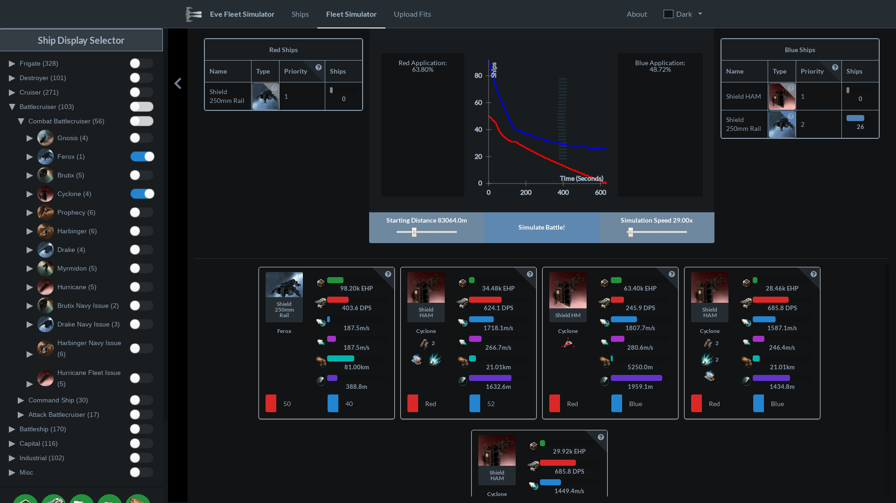

# Eve Fleet Simulator

Eve Fleet Simulator(EFS) is an analysis tool for Eve Online.

Detailed Fleet PvP: EFS makes it easy to simulate PvP by using dynamic AI that mimics real player behavior alongside a wide range of weapons and effect implementations.

Accessibility and Versatility: Over 1000 PvP fits are periodically scraped from [zkill]() and packaged with EFS. These represent some of the best preforming fits from the last 3-6 months. If you need something more specific however you can easily export your own fits from . This makes it easy to test new ideas along with things like wormhole effects or exact skills and implants.

Hull Comparison: In ship mode you can quickly and easily select and sort every ship and subsystem configuration in Eve. This includes information about the hull once fitted, for example effective hitpoints when armor brick tanked or max velocity with a T2 MWD.

## Installation

Use the [EFS website]() to get all the features of EFS without needing to install anything.
If you prefer native applications, want to work offline or want to make sure you don't delete your custom fits from browser storage you can find EFS for Windows, OSX and Linux in the [releases section]().

## Getting started:
Quick examples of how to use EFS can be found in the [quickstart guide](resources/QUICKSTART.md)

## Building Eve Fleet Simulator:

Clone the repo: `git clone [EFS GITHUB URL HERE](...)`
`cd eve_fleet_simulator`
Install EFS: `npm install`

The development build should now be in the `lib/` directory.

Running `production_build.js` will create the production builds for each platform in `dist/`.

The development build can be updated to reflect local changes by running either `build.js` or webpack.

## License
Eve Fleet Simulator is released under the [GNU Affero GPL license](link to license file) and it's [source is available here](github url).

## Contact
Bug reporting and feature requests should be done via the (projects github page)[].
* MaruMaruOO
    * GitHub: @MaruMaruOO
    * Email: evefleetsim@gmail.com

## CCP Copyright Notice
EVE Online and the EVE logo are the registered trademarks of CCP hf.
All rights are reserved worldwide. All other trademarks are the property of their
respective owners. EVE Online, the EVE logo, EVE and all associated logos and
designs are the intellectual property of CCP hf. All artwork, screenshots,
characters, vehicles, storylines, world facts or other recognizable features
of the intellectual property relating to these trademarks are likewise the
intellectual property of CCP hf. CCP hf. has granted permission to Eve Fleet Simulator
to use EVE Online and all associated logos and designs for promotional and
information purposes on its website but does not endorse, and is not in any
way affiliated with, Eve Fleet Simulator.
CCP is in no way responsible for the content on or functioning of this
website, nor can it be liable for any damage arising from the use of this website.

