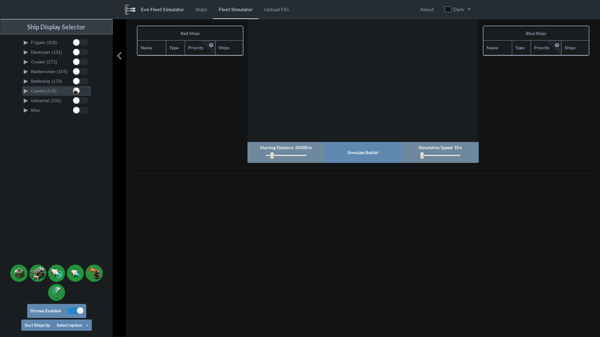
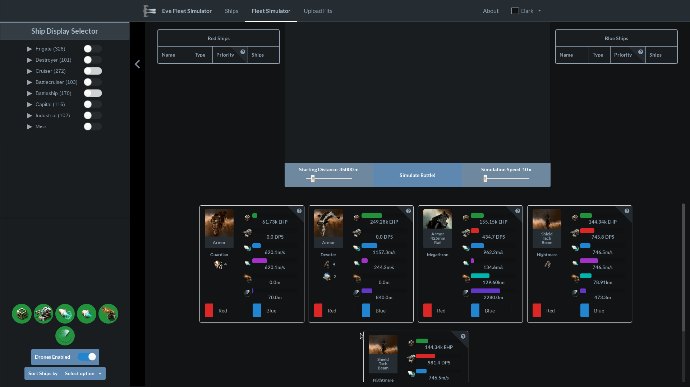
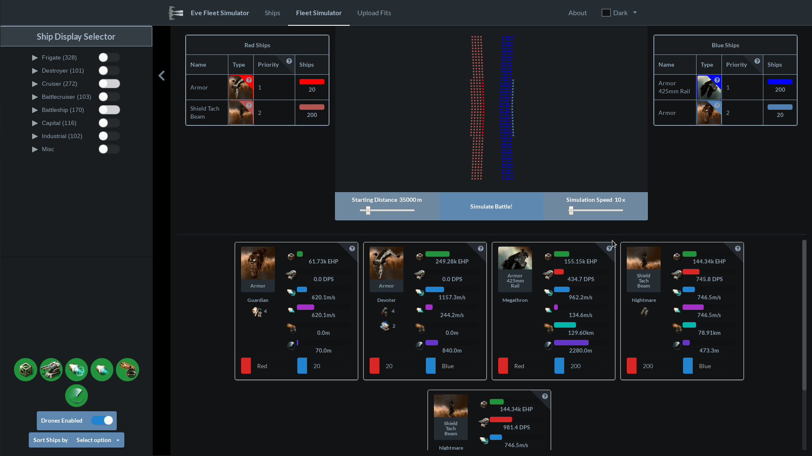
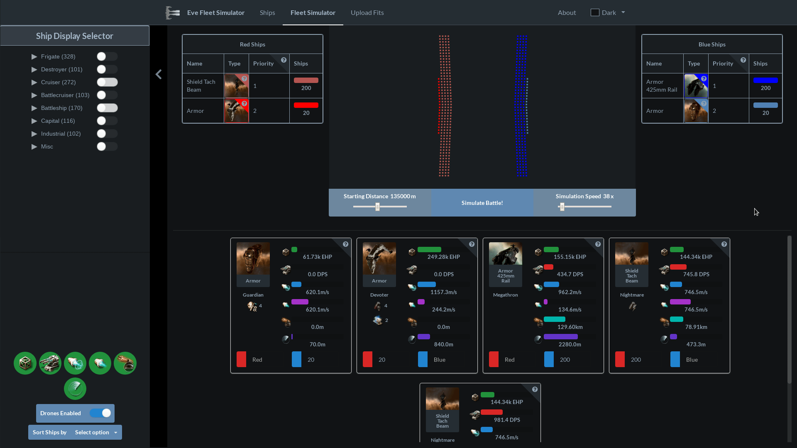
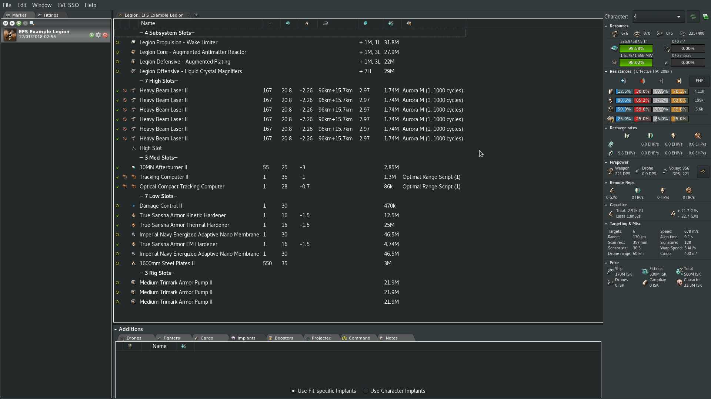

# Quickstart Guide

Display fits by selecting them in the left hand panel.

Add fits to each side.

Adjust starting distance, simulation speed and target priority as desired.

Run the simulation. The simulation speed can be changed at any time.

You can also import custom fits by using pyfa to copy them to the clipboard.
